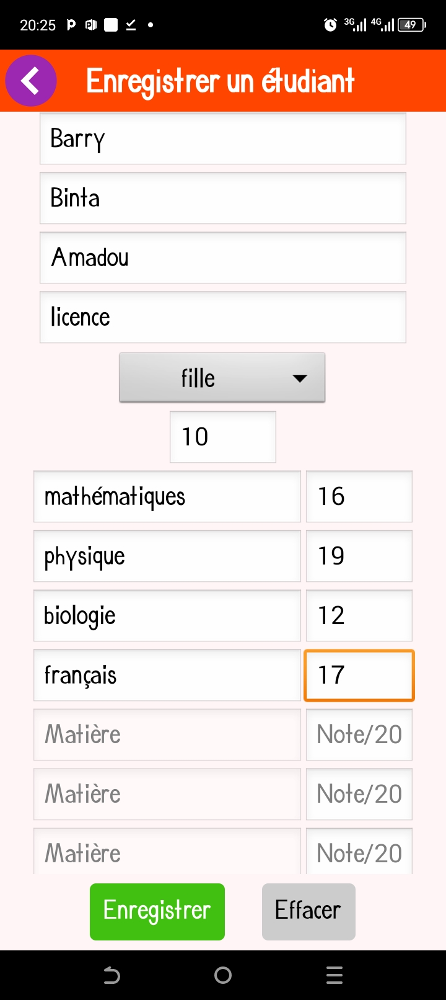
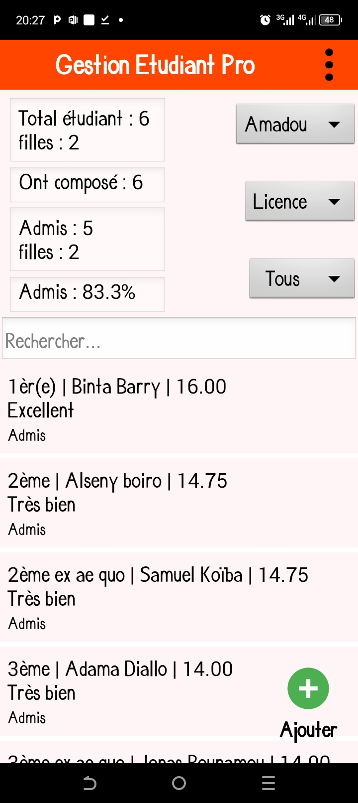
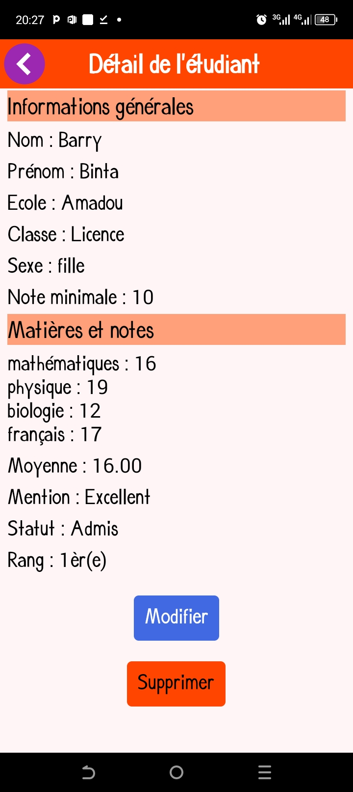
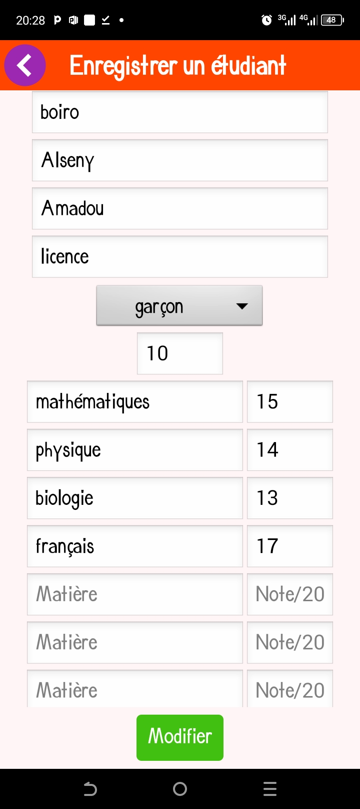

# Gestion des étudiants

Application Android de gestion des étudiants développée avec MIT App Inventor

## Version

**Version actuelle : v1.0.0**

Première version publique de l'application de gestion des étudiants.

## Présentation

Gestion des étudiants est une application Android conçue pour faciliter
la gestion scolaire.

L'application permet d'enregistrer les étudiants, leurs matières et leurs
notes, puis de calculer automatiquement différentes statistiques et le
classement.

Le projet a été conçu et développé avec MIT App Inventor.

## Points techniques

- Stockage local des données avec TinyDB
- Gestion des étudiants
- Ajout et modification des matières et des notes
- Calcul des statistiques
- Classement automatique
- Gestion des étudiants ex æquo
- Filtrage par école, par classe et par sexe 
- Interface adaptée à Android

## Fonctionnalités

- Ajout d'étudiants
- Modification d'étudiants
- Suppression d'étudiants
- Gestion des matières
- Gestion des notes
- Calcul des statistiques
- Classement des étudiants
- Gestion des ex æquo
- Filtrage par classe
- Filtrage par école
- Filtrage par sexe 

## Technologies

- MIT App Inventor
- Android
- TinyDB

## Télécharger l'application

📱 [Télécharger l'APK](GestionEtudiants.apk)

> Version actuelle de l'application de gestion des étudiants.

## Captures d'écran

### Ajout d'un étudiant

### Classement des étudiants

### Détail d'un étudiant

### Modification d'un étudiant

## Améliorations futures

- Synchronisation des données en ligne
- Sauvegarde et restauration des données
- Export des résultats
- Génération de rapports PDF
- Amélioration de l'interface utilisateur
- Ajout de nouvelles statistiques
- Notifications et rappels
- Version disponible sur plusieurs plateformes

## Auteur

Samuel Dieu-donné Koïba (étudiant en licence génie informatique)

## Ce que j'ai appris

À travers ce projet, j'ai appris à :

- Concevoir une application Android
- Manipuler des listes et des données dans App Inventor
- Utiliser TinyDB pour le stockage local
- Créer des algorithmes de classement
- Gérer les ex æquo
- Filtrer et trier des données
- Corriger des problèmes liés à la logique de l'application
- Concevoir une interface utilisateur adaptée à un besoin réel
